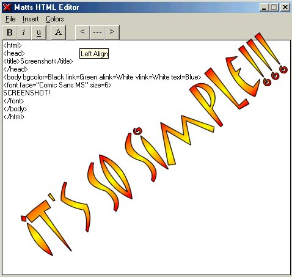



## Beginner Editor

### Description

---This should be updated on the 17th or 18th of september! I've started work on the new version. Check back soon.---

This is a very simple html editor for people who dont know anything about html! its so simple just fill out a little form and youve got yourself a simple html file! (Preview option is now available)
 
### More Info
 

             |
---                |---
**Submitted On**   |2003-08-29 09:09:16
**By**             |[Matt Spokes](https://github.com/Planet-Source-Code/PSCIndex/blob/master/ByAuthor/matt-spokes.md)
**Level**          |Beginner
**User Rating**    |4.3 (13 globes from 3 users)
**Compatibility**  |VB 5\.0, VB 6\.0
**Category**       |[Internet/ HTML](https://github.com/Planet-Source-Code/PSCIndex/blob/master/ByCategory/internet-html__1-34.md)
**World**          |[Visual Basic](https://github.com/Planet-Source-Code/PSCIndex/blob/master/ByWorld/visual-basic.md)
**Archive File**   |[Beginner\_E1637138292003\.zip](https://github.com/Planet-Source-Code/matt-spokes-beginner-editor__1-47955/archive/master.zip)

